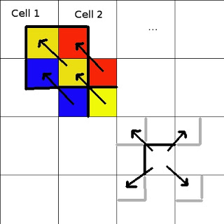

# python-hog

Vectorised implementation of the Histogram of Oriented Gradients

## How to install
 
### Option 1: clone the repository and install

Clone the repository and cd there:
```bash
git clone https://github.com/JeanKossaifi/python-hog
cd python-hog
```
Then install the package (here in editable mode with `-e` or equivalently `--editable`:
```bash
pip install -e .
```

### Option 2: install with pip

Simply run
```bash
pip install git+https://github.com/JeanKossaifi/python-hog
```

## Idea behind the implementation

Because of time-constraints the code might not be as clear as it should be but here is the idea behind it:

### Vectorising the tri-linear interpolation
Assuming we have a gray-scale image represented as an ndarray of shape `(sy, sx)`.
We want to compute the HOG features of that image with `nbins` orientation bins.

First, we interpolate between the bins, resulting in a `(sy, sy, nbins)` array.

We then interpolate spatially. The key observation is that in the end (after interpolation), we do not care about the position of the orientation vectors since all orientation vector for a given cell are going to be summed to obtain only one histogram per cell.
We can thus virtually divide each cell in 4, each part being interpolated in the 4 diagonally adjacent sub-cells.
As a result, each of the 4 sub-cell will be interpolated once in the same cell, and once in the 3 adjacent cells (which is exactly what interpolation is).
The only thing to do is to multiply by the right coefficient. 

To illustrated: We sum 4 times in the 4 diagonal directions. The coefficient for the sum can be represented by a single matrix which is turned.


Finally the histograms in each cell are summed to obtain the `(n_cells_x, n_cells_y, nbins)` desired orientation_histogram (which can be further normalise block-wise).
